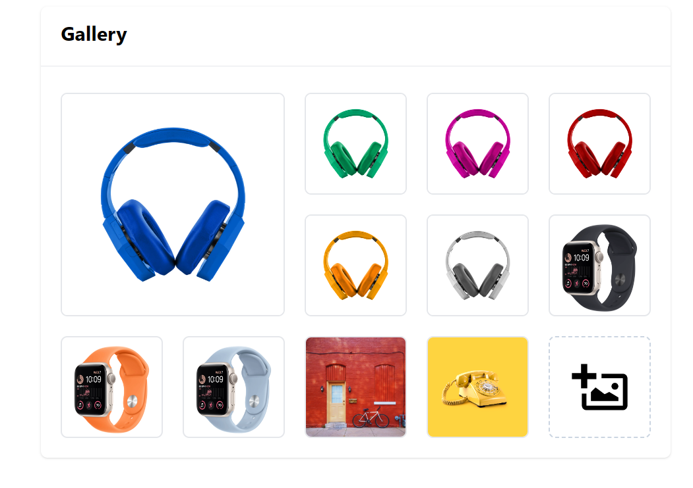

# Image Gallery

**Live Link:** [View the Live Website](https://image-gallery-sakil.netlify.app/)

Welcome to the Image Gallery website! This project is built using React.js, Yarn, Tailwind CSS for styling, and React Router DOM for routing. The Image Gallery website is designed to allow users to manage and organize multiple images. It features a prominent "feature image," the ability to select and delete images, and the unique ability to rearrange image positions via drag-and-drop.



## Table of Contents

- [Features](#features)
- [Getting Started](#getting-started)
- [Usage](#usage)
- [Technologies Used](#technologies-used)
- [Limitations](#limitations)
- [Contributing](#contributing)
- [License](#license)

## Features

- **Feature Image:** One image can be designated as the "feature image" and is displayed prominently in a larger size compared to other images.

- **Select and Delete:** Users can select multiple images and delete them from the gallery.

- **Add Images:** You can add new images to the gallery.

- **Reorder Images:** The most distinctive feature of this website is the ability to drag and drop images to change their positions. Images can be reordered from left-to-right (LTR) in the gallery.

## Getting Started

To get started with the Image Gallery website, follow these steps:

1. Clone the repository to your local machine:

   ```bash
   git clone https://github.com/your-username/image-gallery.git
   ```

2. Navigate to the project directory:
   `cd image-gallery`
3. Install the necessary dependencies using Yarn:
   ```bash
   yarn
   ```
4. Start the development server
   ```bash
    yarn dev
   ```

## Usage

- To designate a "feature image," click on an image, and it will be displayed prominently at the top.

- To select multiple images, click on the checkboxes in the corner of each image.

- To delete selected images, click the "Delete" button.

- To add new images, there should be a UI element to support this. You can modify the code to include an image upload feature.

- To rearrange images, simply click and drag an image to your desired position within the gallery.

## Technologies Used

- React.js: A JavaScript library for building user interfaces.

- Yarn: A package manager for managing project dependencies.

- Tailwind CSS: A utility-first CSS framework for easy and customizable styling.

- React Router DOM: A routing library for React applications.

## Limitations

- **Touch Screen Compatibility:** This project currently does not work on touch screens. Efforts are underway to resolve this issue.

## Contributing

If you'd like to contribute to the development of this project, please follow these steps:

1. Fork the repository on GitHub.

2. Clone your forked repository to your local machine.

3. Create a new branch for your feature or bug fix:

   ```bash
   git checkout -b feature-name
   ```
